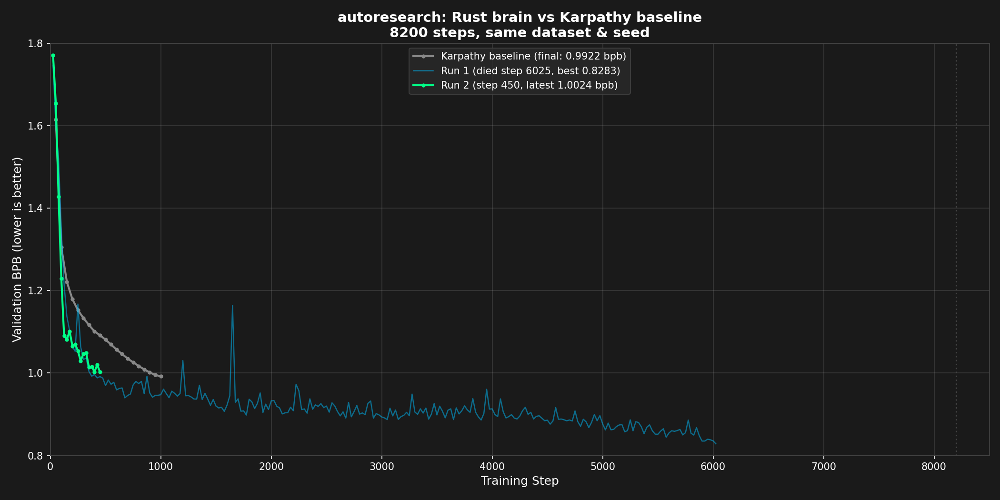

# autoresearch

A Rust + CUDA GPT training engine. No Python in the training loop, no PyTorch, no autograd. Every forward pass, backward pass, and optimizer step is hand-written. The binary links only against CUDA, cuBLAS, and Flash Attention 3.

Starting from Karpathy's [autoresearch](https://github.com/karpathy/autoresearch) Python baseline (**0.9921 bpb** at 1000 steps), systematic architecture search pushed to **0.8673 bpb** — a **0.125 bpb improvement** on the same data, same compute budget, same 1000 steps.

---



---

## Results

### Best result (1000 steps, seed=42)

| Run | model | val_bpb |
|-----|-------|---------|
| Python reference (Karpathy) | depth=8, d_model=512, 50M params | 0.9921 |
| **Rust engine** | **depth=30, d_model=512, 119.5M params** | **0.8673** |
| **improvement** | | **-0.125** |

The gap breaks down as: ~0.011 from bin-packing, ~0.114 from depth scaling (30 vs 8), ~0.007 from embedding LR tuning. Same data, same steps, no tricks.

### Depth sweep (S=256, emb_lr=0.9, cooldown=50%, 1000 steps)

| depth | params | val_bpb | notes |
|-------|--------|---------|-------|
| 8 | 50M | 0.9744 | 700 steps |
| 9 | 53M | 0.9659 | 700 steps |
| 14 | 69M | 0.9200 | 700 steps |
| 18 | 82M | 0.8928 | |
| 20 | 88M | 0.8834 | |
| 28 | 116M | 0.8734 | |
| 29 | 117M | 0.8707 | |
| **30** | **119.5M** | **0.8600** | **best** |
| 31 | 123M | 0.8641 | |
| 32 | 126M | 0.8712 | |
| 33 | 129M | 0.8609 | |
| 34 | 132M | 0.8622 | |
| 48 | 176M | 0.8712 | |
| 60 | 214M | diverged | numerical instability |

Depth=30 is the optimum. Monotonic improvement from depth=8 to 30; beyond that the model is over-parameterized for 524M tokens. Depths 31-34 form a broad shoulder confirming the peak. The binding constraint is compute, not VRAM.

### Window size sweep (depth=30)

| S (local window) | val_bpb |
|------------------|---------|
| 64 | 0.8664 |
| **256** | **0.8600** |
| 1024 | 0.8631 |

### LR sweep (depth=30, seed=42, 1000 steps)

| LR | val_bpb | notes |
|----|---------|-------|
| 0.003 | 0.9499 | too low |
| 0.01 | 0.8775 | |
| 0.02 | 0.8673 | |
| 0.036 | 0.8754 | |
| 0.038 | 0.8687 | |
| **0.040** | **0.8600** | **baseline** |
| 0.042 | 0.8673 | |
| 0.055+ | diverged | too high |

Optimum: LR 0.038-0.042. The landscape is flat near the peak, consistent with Muon's log-scale symmetry. LR=0.04 (Karpathy's default) sits almost exactly at the optimum.

### Other ablations (depth=30, S=256)

| experiment | val_bpb | vs baseline | verdict |
|------------|---------|-------------|---------|
| init_scale=0.68 (baseline) | 0.8600 | - | |
| init_scale=0.5 | 0.8728 | +0.013 | worse |
| MLP_DIM=2048, 4x (baseline) | 0.8600 | - | |
| MLP_DIM=1365, 8/3x | ~0.880 | +0.020 | worse |
| emb_lr=0.9 vs 0.6 | -0.007 | | emb_lr=0.9 wins |
| cooldown=50% vs 25% | -0.008 | | 50% wins |
| cooldown=50% vs 75% | -0.005 | | 50% wins |
| final_lr_frac=0.05 vs 0.01 | 0 | | no difference |
| momentum warmup 0.85->0.95 vs 0->0.95 | better | | 0.85 start wins |

### Neuron rinsing

Tested dynamic layer reinit at 0%, 2%, 5%, and 10% dead-neuron thresholds. Zero reinit events fired across all thresholds. Muon's Newton-Schulz orthogonalization continuously redistributes gradient energy, preventing neuron death entirely. Rinsing code is present but disabled.

---

## Architecture

| Component | Value |
|-----------|-------|
| Layers | 30 |
| d_model | 512 |
| Heads | 4 (head_dim=128) |
| Vocab | 8192 (custom BPE) |
| Seq len | 2048 |
| Attention | SSSSL repeating (S=256 local, L=2048 full) |
| RoPE base | 200,000 |
| Value embeddings | layers 1,3,5,7 (gate_ch=32) |
| Residual scale | learned per layer (init=1.0) |
| x0 skip | learned per layer (init=0.1) |
| Softcap | 15.0 |
| Init scale | 0.68 |
| Activation | ReLU^2 |
| Params | 119.5M |

---

## Training

**Hardware:** H100 SXM 80GB

**Data:** `karpathy/climbmix-400b-shuffle`, streamed from HuggingFace
**Steps:** 1000, seed=42
**Batch:** 524,288 tokens/step (B=64 x 4 grad-accum)

**Optimizer:**
- Muon for weight matrices (peak_lr=0.04, wd=0.2, momentum 0.85->0.95 over 200 steps)
- AdamW for embeddings (lr=0.9 x scale), unembedding (lr=0.005 x scale), scalars (lr=0.5 x scale)
- Muon aspect-ratio scaling: `effective_lr = peak_lr x sqrt(max(1, rows/cols))`

**Schedule:** WSD with 50% cooldown, FINAL_LR_FRAC=0.05

---

## Engine

Hand-written CUDA kernels. No autograd.

```
brain/src/
  main.rs          - CLI, config from env vars
  train.rs         - training loop, WSD schedule, eval, checkpointing
  forward.rs       - GPT forward pass
  backward.rs      - backward pass
  optim.rs         - Muon + AdamW, WSD LR schedule
  buffer.rs        - pre-allocated GPU buffer manager
  gemm.rs          - cuBLAS wrapper
  config.rs        - model constants (compile-time)
  ffi.rs           - Flash Attention 3 bindings
  init_weights.rs  - weight initialization

brain/kernels/    - 13 CUDA kernels
  muon.cu          - Muon optimizer (Newton-Schulz orthogonalization)
  adamw.cu         - AdamW
  fused_norm_residual.cu
  rms_norm.cu
  rope.cu
  cross_entropy.cu
  embedding.cu
  ve_apply.cu      - value embedding gating
  residual_scale.cu
  relu_sq.cu       - squared ReLU
  softcap.cu
  elementwise.cu
  layer_stat.cu    - per-layer L2 norm + scale
```

---

## Build & Run

Requires H100 (sm_90a) for Flash Attention 3, CUDA 12.x, Rust nightly.

```bash
# Build FA3 (first time only)
bash brain/fa3/build_fa3.sh

# Build the engine
FLASH_ATTN_V3_BUILD_DIR=brain/fa3/build cargo build --release

# Run
NUM_TRAIN_SHARDS=794 python3 brain/feeder.py --stream --prefetch 4 2>feeder.log \
  | BATCH_SIZE=64 MAX_STEPS=1000 COOLDOWN_STEPS=500 \
    ./target/release/autoresearch-brain train \
      --stream-input \
      --data-dir /path/to/val/shards \
      --seed 42
```

`feeder.py` streams parquets from HuggingFace, tokenizes, and best-fit bin-packs sequences into 2049-token rows. Bin-packing guarantees 100% token utilization vs ~60% with sequential reads — the source of the 0.036 bpb baseline improvement.

**Important:** `NUM_TRAIN_SHARDS=794` on the feeder only, not the engine.

---

## License

MIT
